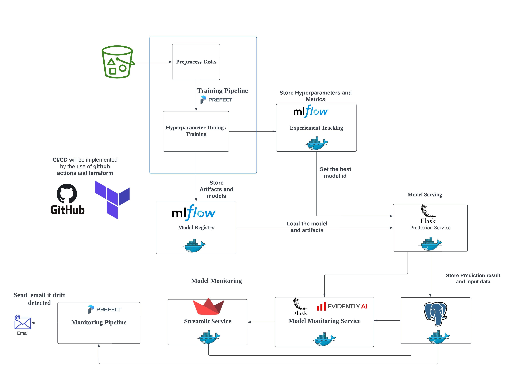

# mlops-capstone-project

## Problem Description

Dtaset can be downloaded from kaggle at [here](https://www.kaggle.com/datasets/iammustafatz/diabetes-prediction-dataset)

This is the implementation of capstone project for mlops-zoomcamp from [DataTalksClub](https://datatalks.club/). The project provides the **diabetes prediction service** for the patients in the hospital by using the patients' medical information. Let's imagine that the aim is to predict whether the patient has the diabetes or not and take necessary actions based on the result.

The main focus of the project is to apply the MLops principles like experiment tracking, training pipeline, model monitoring concepts to the machine learing projects rather than getting state-of-the-art accuracy.

## Training Pipeline

### 1. Install the library at the root level.

```bash
pip install --user pipenv
pipenv install --python=3.9
```

### 2. Setup model's registry requirments

- Run `make setup-model-registry`. (Do it only for the first time running and yon don't need to do it for next time.) 

- It just create the folder named **mnt** inside the home directory to save the metrics and artifacts from mlflow_server service.

### 3. Start prefect server

- Start the prefect server in **another terminal** to run the training pipeline. Start by `make prefect-server-start`.

### 4. Run the training pipeline

- Run the training pipeline which train **XGBoost** model and registry the best model in the experiment in the **mlflow model registry**. 

- You can run by `make run-training-pipeline`.

### 4.1. Run the training pipeline with the data from s3.(Optional)

- To run the training pipeline with the data downloaded from s3 (additionally, it will also upload the training, validation and test data to the s3 bucket), you can use `make run-training-pipeline-s3`.


### 5. Deploy the training pipeline in prefect

- You need to create the workpool named **train-pool** by using `make create-workpool`. 

- After that, you can deploy the training pipeline by using `make deploy-training-pipeline`.

- (This step is only needed for the one time if it succeed.)

### 6. Run the deployed training pipeline 

- In order to run the deployed training pipeline, you need to start a worker in a **separate terminal** by `make start-worker`. 

- After starting the worker, you can run the deployed training pipeline by using `make run-deployed-training-pipeline`.

### 6.1. Run the deployed training pipeline  with s3 data

- It has the same behaviour as **4.1.**. In order to run, use `make run-deployed-training-pipeline-s3`.

## Model Serving

- The trained model will be deployed as HTTP service by using *flask* and *gunicorn*. 
- **Note:** In order to deploy the model as a service, you need to run the **training pipeline** at least once to have the production model in the mlflow model registry. And you also need to up the **mlflow_server** service to access this model. 

### 1. Start the diabetes service 

- You can start the diabetes-service by running `make start-diabetes-service`.

## Model Monitoring

For model monitoring, the **diabetes-service** from **model serving** part and the **mlflow_server** service will be needed to be up.

### 1. Preparing reference data

- You need to copy validation data named **valid.parquet** from the data folder to the **data** folder inside **monitoring**.

- Then start diabetes-service by `make start-diabetes-service`. 
- After that,  run `make prepare-reference` to prepare reference data.

### 2. Start all other services inside docker-compose.yml

- All other services inside docker compose file will be needed to be up and you can do it by using `make start-all-services`.

### 3. Create the database named **production** in the postgresql service 

- You need to create the database named **production** to save the prediction result for monitoring purpose. 

- This prediction log will become the **current data** for checking the data drift. You can create it by using `make create-db`.

### 4. Send the simulation data to the monitoring api

- You have to send the **simulation data** to the monitoring api for the purpose of model monitoring. You can send it by using `make send-data-to-monitoring-api` in another terminal.

- While sending the data, you can check the data inside the table named **prediction_log** inside the database.

### 5. Check the data drift and target drift

- You can check the data drift and target drift when there is a certain amount of data inside the table. You can check the data inside with [**adminer** tool](http://localhost:8080). 

- You can login the adminer by using 

    - **db** for server
    - **admin** for username
    - **example** for password 
    - **production** for database 
<br><br>

- Then go to the [streamlit service](http://localhost:8501) and you will see the streamlit UI. Then click the **Data Drift** button to check the report about **data drift**. 

- Then click the **Target Drift** button to check the report about **target drift**.

### 6. Deploy the monitoring pipeline in prefect

- We can deploy the **monitoring pipeline** that can send an email as an alert if the drift is detected on current data. You can implement it by deploying the workflow in the prefect.

### 6.1. Create an email block for prefect

- Create an email block by using `make create-email-block`. Before creating email block, you need to set environment variable named

    - EMAIL_USERNAME
    - EMAIL_PASSWORD

- The easiest way to set is using **.env** file. You can set the value inside of that file. **EMAIL_PASSWORD** is not your password; it's called the appword. You can check how to generate it at [here](https://support.google.com/mail/answer/185833?hl=en)

### 6.2. Running the monitoring pipeline.

- If you want to check the data drift for yesterday's data, just run `make run-monitoring-pipeline`.

- If you want to check for specific day's data, run `pipenv run python monitoring/send_alerts.py -d <day> -m <month> -y <year>`. You can replace <day>, <month> and <year> as the date you want to check.

Eg. This command, `pipenv run python monitoring/send_alerts.py -d 9 -m 8 -y 2023` will run the data drift check for **9 August 2023**. 

### 6.3. Running the deployed monitoring pipeline

- First, you need to deploy monitoring pipeline with `make deploy-monitoring-pipeline`. 

- In order to run monitoring pipeline, you need to start workpool by `make start-worker`.

- You can run the deployed workflow by `make run-deployed-monitoring-pipeline`. And it will check the data drift for yesterday.

- For specific day, run `pipenv run prefect deployment run -p day=<day> -p month=<month> -p year=<year> send-alert/deploy_monitor`. You can replace it as you like.

## Testing

### 1. Check the unit test.

- You can run unit test by `make run-unit-test`.

### 2. Check the integration test.

- You can run integration test by `make run-integration-test`. 
- In order to run integration test, you need to down all docker services. You can do this by `make stop-all-services`.

### 3. Check the quality of the code by linting tools.

- You can run by `make quality-check`.

## Services

All these service except prefect can be started by using **docker compose** by `make start-all-services`. 

|   Service |   Port    |   Interface   |   Description |
| --- | --- | --- | --- |
|   mlflow_server   |   5000    |   127.0.0.1   |   MLflow experiment tracking and model registry   |
|   prefect   |   4200    |   127.0.0.1   |  Prefect Workflow Orchestration   |
|   diabetes_service   |   5010    |   127.0.0.1   |   Diabetes Prediction Service   |
|   monitoring_service   |   5020    |   127.0.0.1   |   Monitoring Service (use the prediction service above and save the result)   |
|   monitoring_db   |   5432    |   127.0.0.1   |   Postgresql Database   |
|   monitoring_adminer   |   8080    |   127.0.0.1   |   Adminer Tools (to check inside database)   |
|   streamlit_service   |   8501    |   127.0.0.1   |   Streamlit web service to visualize the data and target drift   |

## Process Diagram

You can see the complete system design below.

<br>