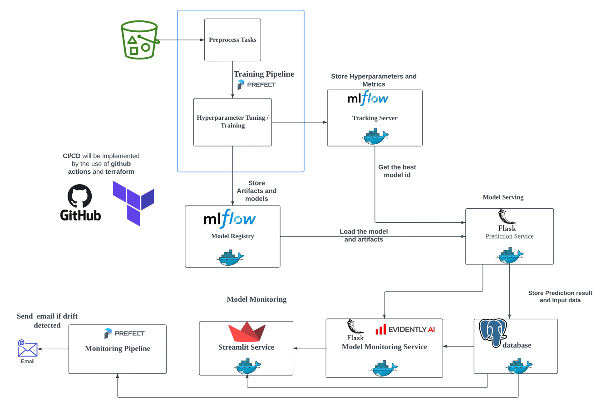

# mlops-capstone-project

You can see the complete system design below.

<br>

## Training Pipeline

### 1. Install the library at the root level.

```bash
pip install --user pipenv
pipenv install
```

### 2. Setup model's registry requirments.

Run `make setup-model-registry`. Do it only for the first time running and yon don't need to do it for next time. It just create the folder named **mnt** inside the home directory to save the metrics and artifacts from mlflow_server service.

### 3. Start prefect server.

Start the prefect server in **another terminal** to run the training pipeline. Start by `make prefect-server-start`.

### 4. Run the training pipeline.

Run the training pipeline which train **XGBoost** model and registry the best model in the experiment in the **mlflow model registry**. You can run by `make run-training-pipeline`.

### 4.1. Run the training pipeline with the data from s3.

In real world, the raw data should not be saved in github. We have to upload the data in s3 bucket or somewhere and when it's time to train the data, we will download the data from there to local computer. For this step to implement, you need to configure `aws cli` and create the s3 bucket and upload the data to s3. If you save the data in s3 bucket, you don't need to have the data in the local. You need to set `BUCKET_NAME`, `OBJECT_NAME`, `AWS_ACCESS_KEY_ID`, `AWS_SECRET_ACCESS_KEY` and `AWS_DEFAULT_REGION` in **.env** file in the root directory. Otherwise, you will need to use `export AWS_DEFAULT_REGION=ap-southeast-1` to set the environment variable.

To run the training pipeline with the data downloaded from s3 (additionally, it will also upload the training, validation and test data to the s3 bucket), you can use

```shell
make run-training-pipeline-s3
```

### 5. Deploy the training pipeline in prefect (This step is only needed for the one time if it succeed.)

You need to create the workpool named **train-pool** by using `make create-workpool`.
After that, you can deploy the training pipeline by using `make deploy-training-pipeline`.

### 6. Run the deployed training pipeline 

In order to run the deployed training pipeline, you need to start a worker in a **separate terminal** by `make start-worker`. 

After starting the worker, you can run the deployed training pipeline by using `make run-deployed-training-pipeline`.

### 6.1. Run the deployed training pipeline  with s3 data

It has the same behaviour as **4.1.**. In order to run, use `make run-deployed-training-pipeline-s3`.

## Model Serving

The trained model will be deployed as HTTP service by using *flask* and *gunicorn*. (**Note:** In order to deploy the model as a service, you need to run the training pipeline at least once to have the production model in the mlflow model registry. And you also need to up the mlflow_server service to access this model.)

### 1. Start the diabetes service 

You can start the diabetes-service by running `make start-diabetes-service`.

## Model Monitoring

For model monitoring, the diabetes-service from **model serving** part and the mlflow_server service will be needed to be up.

### 1. Start all other services inside docker-compose.yml.

All other services inside docker compose file will be needed to be up and you can do it by using `make start-all-services`.

### 2. Create the database named **production** in the postgresql service. 

You need to create the database named **production** to save the prediction result for monitoring purpose. This prediction log will become the **current data** for checking the data drift. You can create it by using `make create-db`.

### 3. Send the simulation data to the monitoring api.

You have to send the **simulation data** to the monitoring api for the purpose of model monitoring. You can send it by using `make send-data-to-monitoring-api` in another terminal.

While sending the data, you can check the data inside the table named **prediction_log** inside the database.

### 4. Check the data drift and target drift.

You can check the data drift and target drift when there is a certain amount of data inside the table. You can check the data inside with [**adminer** tool](http://localhost:8080). You can login the adminer by using *db* for server, *admin* for username, *example* for password and *production* for database.

Then go to the [streamlit service](http://localhost:8501) and you will see the streamlit UI. Then click the **Data Drift** button to check the report about **data drift**. Then click the **Target Drift** button to check the report about **target drift**.

### 5. Deploy the monitoring pipeline in prefect

We can deploy the monitoring pipeline that can send an email as an alert if the drift is detected on current data. You can implement it by deploying the workflow in the prefect.

**The note will be continued.**


## Testing

1. Check the unit test.

You can run unit test by `make run-unit-test`.

2. Check the integration test.

You can run integration test by `make run-integration-test`. In order to run integration test, you need to down all docker services. You can do this by `make stop-all-services`.

3. Check the quality of the code by linting tools.

You can run by `make quality-check`.


