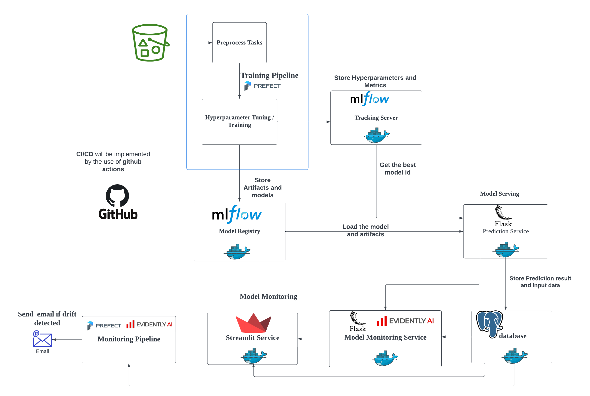

# mlops-capstone-project

You can see the complete system design below.

<br>

## Training Pipeline

### 1. Install the library at the root level.

```bash
pip install --user pipenv
pipenv install
```

### 2. Setup model's registry requirments.

Run `make setup-model-registry`. Do it only for the first time running and yon don't need to do it for next time.

### 3. Start prefect server.

Start the prefect server in **another terminal** to run the training pipeline. Start by `make prefect-server-start`.

### 4. Run the training pipeline.

Run the training pipeline which train **XGBoost** model and registry the best model in the experiment in the **mlflow model registry**. You can run by `make run-training-pipeline`.

### 5. Deploy the training pipeline in prefect (This step is only needed for the one time if it succeed.)

You need to create the workpool named **train-pool** by using `make create-workpool`.
After that, you can deploy the training pipeline by using `make deploy-training-pipeline`.

### 6. Run the deployed training pipeline 

In order to run the deployed training pipeline, you need to start a worker in a **separate terminal** by `make start-worker`. 

After starting the worker, you can run the deployed training pipeline by using `make run-deployed-training-pipeline`.

## Model Serving

The trained model will be deployed as HTTP service by using *flask* and *gunicorn*. **Note:** In order to deploy the model as a service, you need to run the training pipeline at least once to have the production model in the mlflow model registry. And you also need to up the mlflow_server service to access this model.

You can start the diabetes-service by running `make start-diabetes-service`.

## Model Monitoring


