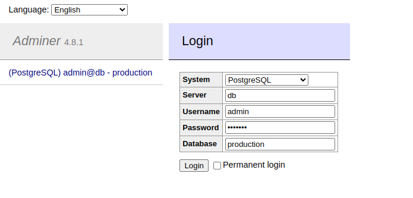
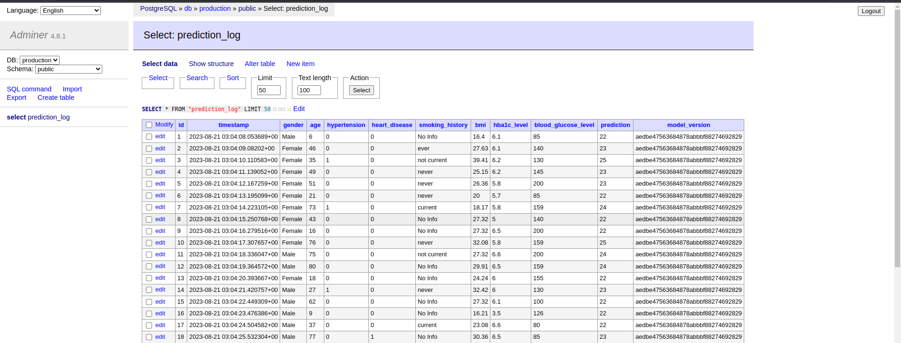
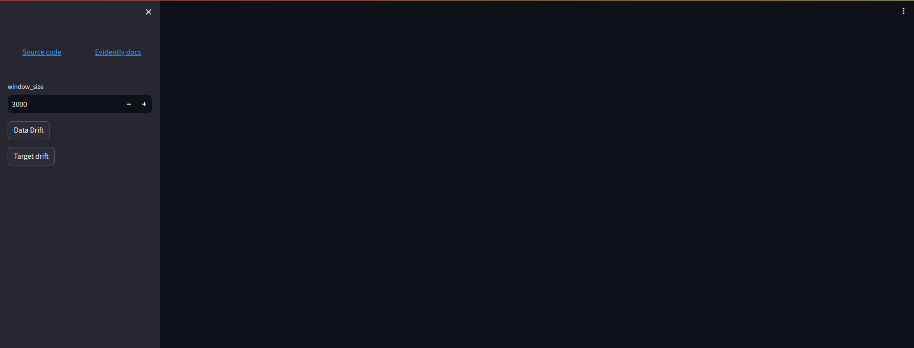
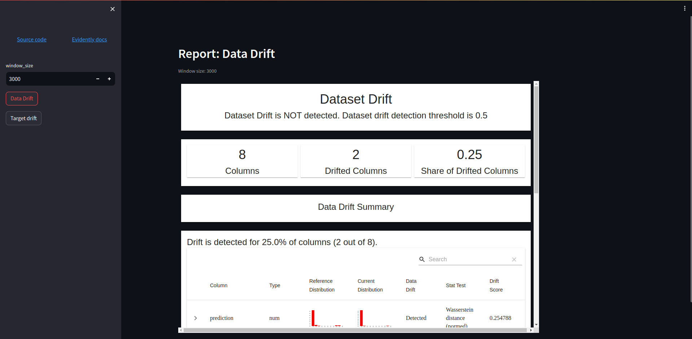
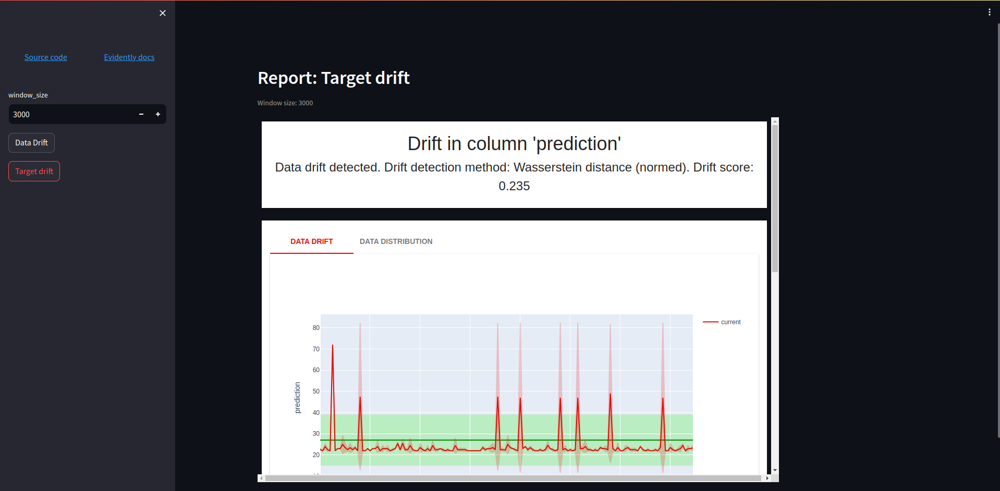
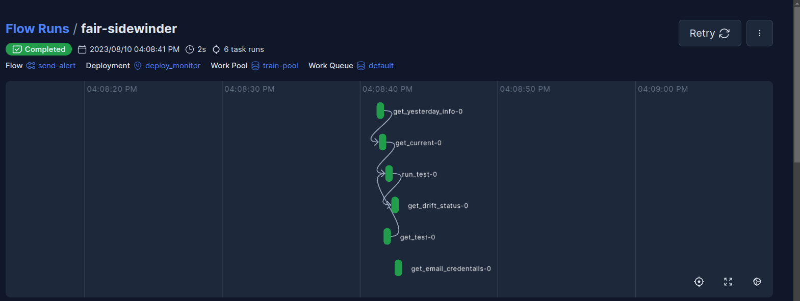

# Model Monitoring

## Model Monitoring service

Monitoring component consists of

- **Postgresql Database** to store the prediction log
- **Adminer** tools to interact with the database
- **Monitoring service**
- **Streamlit dashboard** to check the data drift visually

All services from above will be run from docker compose.

**Monitoring service** has three endpoints.

- **predict_monitor** which can predict the data from the json payload by using the dockerized service from **deployment part** and saves the input and prediction result in the database.
- **monitor_target_drift** which can generate report about the target drift on **window_size**.
-  **monitor_data_drift** which can generate report about the data drift on **window_size**.

**Note:** window_size means the last data inside the database. window_size=300 means the last 300 rows of data inside the database.

#### Adminer tool

#### Prediction log inside the database

## Streamlit service

The report about data drift and target drift can be checked from **streamlit dashboard**.

#### Streamlit dashboard
 

  

 

## Monitoring Pipeline

The **monitoring pipeline** can be deployed as a workflow by using **prefect**. With prefect, the workflow can be scheduled and triggered via API.

Monitoring pipeline can be sent **an alert email** to the email address from prefect's email block. It has two modes for implemention.

1. The first one is the **default mode**. In default mode, it checks the prediction log from yesterday whether there is the data drift or not. If data drift is detected, an email will be sent.
2. The second one is the mode which can give the parameter argument to the pipeline in order to check the data drift for the **specific day**.

Deployment name for this pipeline is **deploy_monitor** and work pool name for deployment is **train-pool** which is the same workflow for training pipeline.

#### Monitoring Pipeline with prefect Example
 

